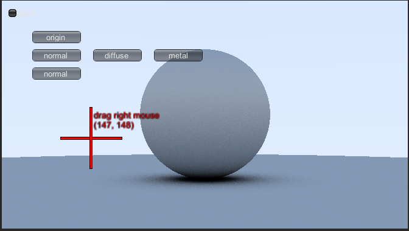
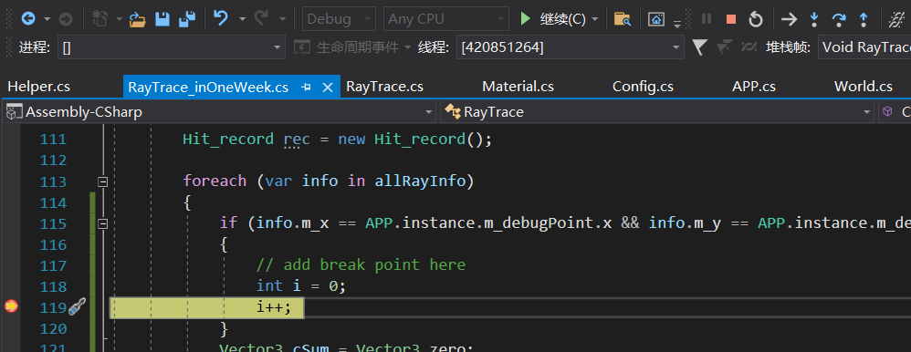
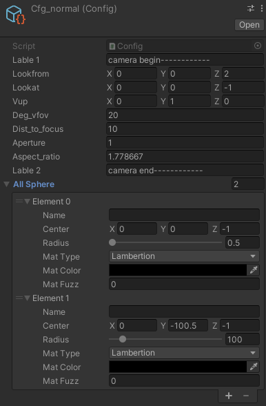
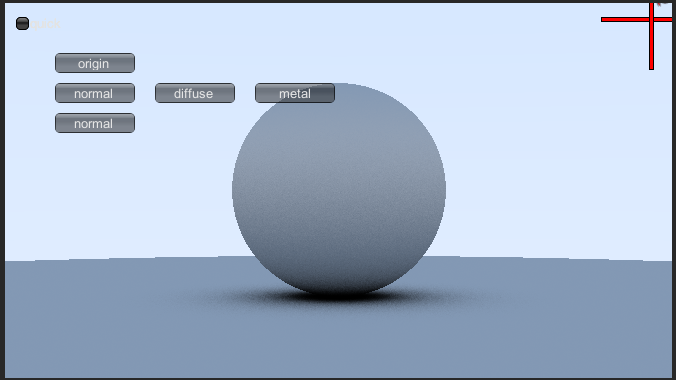
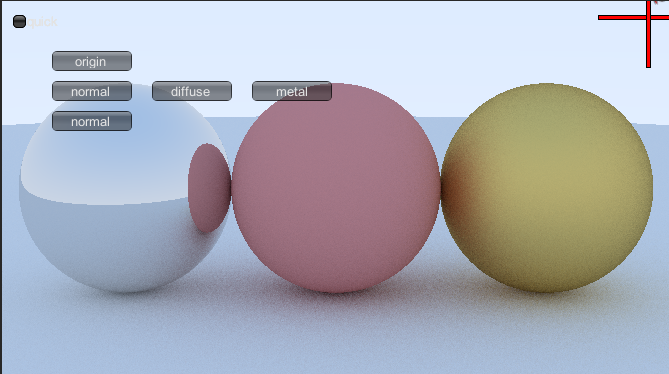
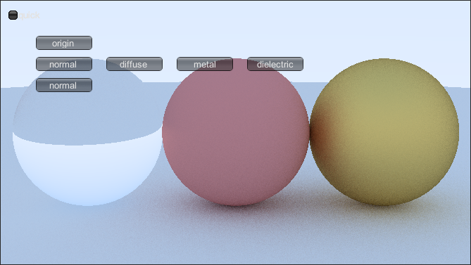

# rayTrace_unity
# 感谢
感谢https://raytracing.github.io/books/RayTracingInOneWeekend.html
所有的内容都基于网站，感谢作者的开源。
# 为什么Unity
### c#写起来比c++顺手
### 可以调试。还有什么比调试更重要的呢？
第一步：拖动+字到想要调试的坐标

第二步：在代码里面打断点

第三步：重新点击rayTrace的按钮
### 支持快速，慢速光追。有了快速验证，用户体验就大大提升了
在左上角有个quick的选项。
如果是快速，每个点只有1个光线，整个光追估计只要1秒。
如果不是快速，每个点有100个光线，整个光追估计只要1分钟。
### 支持配置
摄像机的参数，world的参数都可以配置，修改之后，重新点击rayTrace的按钮就可以拉

# 如何扩展
如果你需要验证自己的material，可以仿照metal，全局搜搜metal，所有有metal的地方都实现一遍自己的material
# 部分成果
diffuse

metal

dielectric

